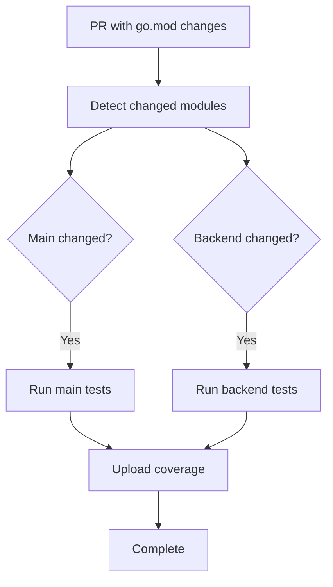

# Dependency Update Automation

This document describes the automated dependency management system for KiviGo.

## Overview

KiviGo uses Dependabot to automatically monitor and update Go dependencies across the main project and all backend modules. The system is designed to:

1. **Monitor multiple modules**: Main project + 6 backend modules (badger, consul, dynamodb, etcd, local, redis)
2. **Group updates per module**: Reduce PR spam by grouping all dependency updates for each backend
3. **Selective testing**: Run only relevant tests based on which module's dependencies changed
4. **Weekly schedule**: Updates are checked every Monday to maintain a predictable cadence

## Configuration Files

### `.github/dependabot.yml`

Configures Dependabot to monitor dependencies for:
- Main project (`/go.mod`)
- Each backend module (`/backend/*/go.mod`)

Key features:
- **Dependency grouping**: All updates for a backend are grouped into a single PR
- **Scheduled updates**: Weekly checks on Mondays (staggered timing to avoid conflicts)
- **PR limits**: Reasonable limits to prevent too many open PRs
- **Clear labeling**: PRs are labeled by module type for easy identification

### `.github/workflows/dependency-updates.yml`

Workflow that triggers when go.mod files are modified, providing:
- **Smart change detection**: Determines which modules were modified
- **Selective testing**: Runs tests only for affected modules
- **Coverage reporting**: Maintains test coverage visibility
- **Multi-Go version testing**: Tests against Go 1.23 and 1.24
- **Robust error handling**: Provides clear feedback on test failures
- **Timeout protection**: Tests have 300s timeout to prevent hanging
- **Empty matrix handling**: Gracefully handles cases with no changes

## How It Works

### 1. Dependabot Monitoring

Every Monday, Dependabot checks for updates to:
- Main project dependencies (09:00)
- Backend dependencies (09:30-12:00, staggered by 30 minutes)

### 2. Grouped Updates

Instead of creating separate PRs for each dependency, Dependabot groups all updates for a module:
- ✅ Single PR for all badger dependencies
- ✅ Single PR for all consul dependencies  
- ✅ Single PR for all redis dependencies
- ❌ No separate PRs for individual dependencies

### 3. Selective Testing

When a dependency update PR is opened:



### 4. Test Matrix

For each affected module, tests run on:
- Go 1.23
- Go 1.24

Only one Go version uploads coverage to avoid duplicates.

## Benefits

### For Maintainers
- **Reduced noise**: Fewer PRs to review (grouped updates)
- **Fast feedback**: Only relevant tests run, faster CI
- **Consistent schedule**: Predictable update cadence
- **Safe updates**: Full test coverage before merge

### For Contributors  
- **Clear labeling**: Easy to identify dependency PRs
- **Focused testing**: Quick feedback on changes
- **No conflicts**: Staggered update times prevent merge conflicts

## Labels and Organization

Dependabot PRs are automatically labeled:

### Main Project
- `dependencies`
- `go` 
- `main`

### Backend Modules
- `dependencies`
- `go`
- `backend`
- `{backend-name}` (e.g., `consul`, `redis`)

## Manual Intervention

### Force Update Check
To manually trigger dependency checks outside the schedule:
1. Go to repository Settings → Security → Dependabot
2. Click "Check for updates" on desired modules

### Customizing Schedule
To modify update frequency, edit `.github/dependabot.yml`:

```yaml
schedule:
  interval: "daily"    # or "weekly", "monthly"
  day: "monday"        # for weekly
  time: "09:00"        # UTC time
```

### Adding New Backends
When adding a new backend module:

1. Add entry to `.github/dependabot.yml`:
```yaml
- package-ecosystem: "gomod"
  directory: "/backend/newbackend"
  schedule:
    interval: "weekly"
    day: "monday"  
    time: "12:30"  # Use next available time slot
  groups:
    newbackend-dependencies:
      patterns:
        - "*"
```

2. The dependency update workflow will automatically detect and test the new backend.

## Troubleshooting

### Common Issues

**Dependabot not creating PRs**
- Check that go.mod files exist in expected locations
- Verify directory paths in dependabot.yml are correct
- Check Dependabot security settings in repository

**Tests failing on dependency updates**
- Review test logs to identify breaking changes
- Backend tests have 300s timeout to handle slow operations
- Consider pinning problematic dependencies temporarily
- Update test expectations if API changes are expected

**Workflow failures with empty matrices**
- The workflow automatically handles cases where no backends change
- Empty JSON arrays are properly handled to prevent matrix failures

**Too many open PRs**
- Increase `open-pull-requests-limit` in dependabot.yml
- Merge or close existing PRs to allow new ones

**Coverage upload issues**
- Coverage files are created in the correct backend directories
- Only Go 1.24 uploads coverage to avoid duplicates

### Monitoring

Check Dependabot status:
1. Repository → Insights → Dependency graph → Dependabot
2. View update history and any errors

View test results:
1. Repository → Actions → Dependency Update Tests
2. Check specific runs for detailed test output

## Integration with Existing Workflows

The dependency update system integrates with existing KiviGo workflows:

- **Does not conflict** with `go-test.yml` (different triggers)
- **Complements** `go-lint.yml` (runs linting on changed modules)
- **Independent** of `release.yml` (updates don't trigger releases)

This ensures dependency updates are thoroughly tested without disrupting the main development workflow.